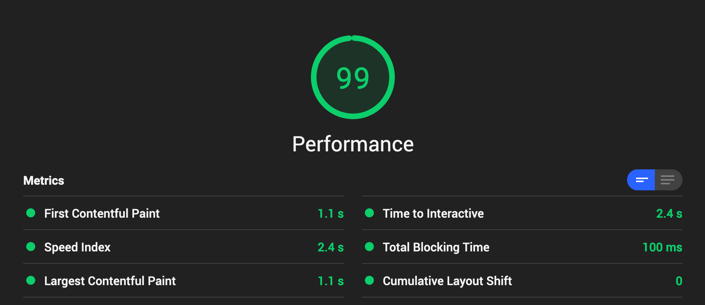

[`#leeway`](https://leeway.apolloelements.dev) is an example chat PWA that uses `lit-apollo` to make it easier for you to avoid doing actual work. [Source Repository](https://github.com/apollo-elements/leeway)

This repo demonstrates how to build an app using Apollo Elements with minimal use of JavaScript and Shadow DOM. There are many ways to build an app with web components, for a more traditional component-oriented approach with stronger encapsulation, see [launchctl](https://github.com/apollo-elements/launchctl).

## Features
- Page loads offline via Service Worker
- <abbr title="server side rendering">SSR</abbr> for initial data payload via Apollo Server
  - *NO* SSR for components, only for data
- Code Splitting with Rollup
- Aggressive minification, including `lit-html` template literals
- CSS-in-CSS ( e.g. `import shared from '../shared-styles.css';`)
- GQL-in-GQL ( e.g. `import query from './my-component-query.graphql';`)
- GraphQL Subscriptions over websocket



# Installation
```
npm ci
```

# Run Locally
```
npm run watch
```

## 3rd-Party Licenses
See [dependencies.txt](./dependencies.txt) for information about 3rd-party software licenses.
